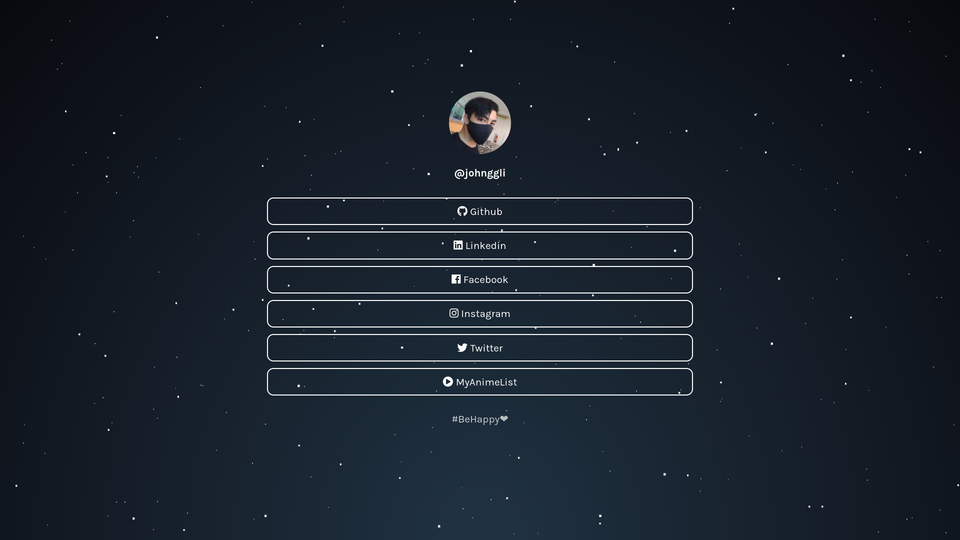

<h1 align="center">🌲 Linktree</h1>
<h3 align="center">Simple site to group all my profiles on social networks in one place.</h3>

 
  
  
  
  

  <a href="#-about-the-project">About the project</a>&nbsp;&nbsp;&nbsp;|&nbsp;&nbsp;&nbsp;
  <a href="#-getting-started">Getting started</a>&nbsp;&nbsp;&nbsp;|&nbsp;&nbsp;&nbsp;
  <a href="#-how-to-contribute">How to contribute</a>&nbsp;&nbsp;&nbsp;|&nbsp;&nbsp;&nbsp;
  <a href="#-license">License</a>

---

  

---

## 💡 About the project

This is an open source project that serves as a free alternative to the Linktree website.
- [Demo]([https://paulo-amaral.vercel.app/])

